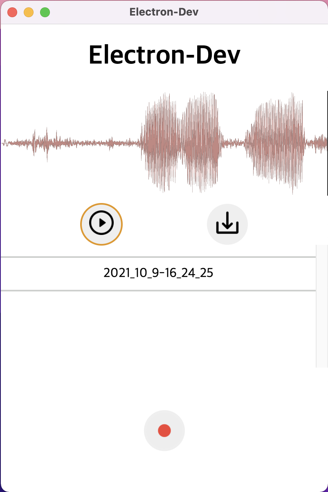
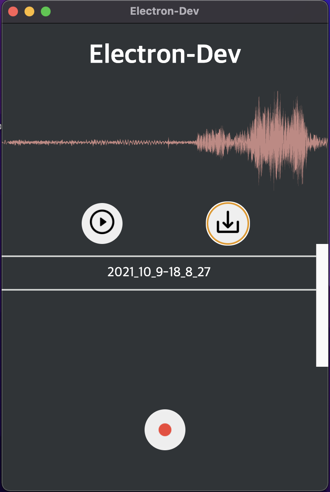

# Electron-dev
Desktop Application included Speech Enhancement Model 

## Demo

    
    
    <!---->

## Reference
> Speech Enhancement Model 
> - <a href="https://arxiv.org/abs/2010.15508" target="_blank">FullSubNet</a> (converted tensorflow)  

> Desktop Application 
> - Electron : <a href="https://www.electronjs.org/" target="_blank">Electron.org</a> 
> - WaveForm : <a href="https://wavesurfer-js.org/" target="_blank">Wavesurfer.js</a>
> - Tensorflow : <a href="https://www.tensorflow.org/js/" target="_blank">Tensorflow.js</a>
> - Images : <a href="https://www.flaticon.com/" target="_blank">Flaticon</a>

### Develop Environment
1. MacOS(~~Big Sur~~ Monterey, <code>Intel</code>)
2. Visual Studio Code
3. Vanila JS

### How to Start
<code>brew install node</code> 
<code>npm install electron --save-dev</code> 
Also can install <code>electron-quick-start</code> uploaded on <a href="https://github.com/electron/electron-quick-start" target="_blank">Github</a>

# Information
- process : main(Backend), renderer(Frontend)
- communication module : ipcMain, ipcRenderer, remote

# Requirement
- node
- npm
- electron@15.3.0
- electron-is-dev@2.0.0 <code>npm install electron-is-dev</code>
- electron-builder@22.13.1 <code>npm install electron-builder</code>
- wavesurfer.js@5.2.0 <code>npm install wavesurfer.js --save</code>